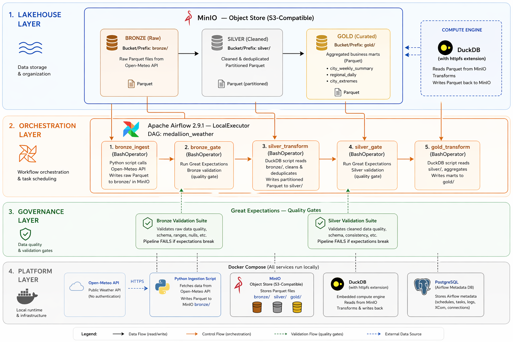

# Medallion Data Lakehouse

**A production-style Bronze → Silver → Gold data lakehouse on MinIO that ingests daily weather data from the Open-Meteo API, validates every layer with Great Expectations quality gates, deduplicates and aggregates via DuckDB SQL, and orchestrates the full pipeline with Apache Airflow — serving 3 analytics-ready business marts.**

> Built as part of an accelerated Data Engineering program · April 2026

---

## Architecture



The pipeline fetches daily weather observations for 5 cities (Karachi, Lahore, Islamabad, Mumbai, Dubai) from the Open-Meteo API every day via Airflow. Raw API responses land in the Bronze layer as Parquet on MinIO (S3-compatible object storage). A Great Expectations gate validates Bronze data — row count, schema, value ranges, temperature sanity. If Bronze passes, DuckDB window functions deduplicate overlapping ingestions in the Silver layer and cast data types to their proper form. A stricter Silver gate checks compound uniqueness and referential completeness. Finally, Gold runs three DuckDB aggregation queries that produce pre-joined business marts ready for dashboard consumption. Every layer is idempotent — scripts can be re-run safely without duplicate-key errors.

---

## Tech Stack

| Tool | Version | Role |
|------|---------|------|
| **MinIO** | Latest | S3-compatible object storage for all three medallion layers |
| **DuckDB** | 0.10 | Embedded OLAP engine — reads Parquet over S3 via `httpfs` |
| **Great Expectations** | 0.18 | Data quality framework — gates between every layer |
| **Apache Airflow** | 2.9.1 | Orchestration with LocalExecutor and BashOperator chain |
| **Python** | 3.11 | pandas, pyarrow, requests, minio-py |
| **Parquet** | Snappy-compressed | Columnar storage format with Hive partitioning |
| **Docker Compose** | — | Full stack spin-up (MinIO + Postgres + Airflow services) |

---

## How It Works

### 1. Bronze Ingestion

The `bronze_ingest.py` script calls the Open-Meteo Archive API for each of 5 cities, requesting the past 7 days of daily weather (max/min/mean temperature, precipitation, wind speed). Responses are combined into a single pandas DataFrame, enriched with ingestion metadata (`_ingested_at`, `_source_url`), and written as a snappy-compressed Parquet file to `s3://lakehouse/bronze/weather/ingest_date=YYYY-MM-DD/data.parquet`. The Bronze layer preserves the raw API shape — no cleaning, no casting, no deduplication — so the original data is always recoverable.

### 2. Bronze Quality Gate

`bronze_expectations.py` reads the Bronze partition via DuckDB's S3 extension, wraps the DataFrame with Great Expectations (`ge.from_pandas`), and runs 11 expectations: row count within 25–50 range, required columns present, `city` values restricted to the expected set of 5, `time` in ISO date format, temperatures in a sane range of -50 to 60°C, wind speed and precipitation non-negative, and `min_temp ≤ max_temp`. On any failure, the script exits with code 1, which Airflow interprets as a failed task and short-circuits the downstream Silver transform.

### 3. Silver Transformation

The `silver_transform.py` script reads *all* Bronze partitions using a glob pattern. Because each daily Bronze ingestion pulls a 7-day window, neighbouring ingestions overlap — the same (city, date) appears in multiple Bronze files. DuckDB's `ROW_NUMBER() OVER (PARTITION BY city, time ORDER BY _ingested_at DESC)` window function picks the latest ingestion per (city, date), then `WHERE rn=1` drops the duplicates. The `time` column is cast from text to `DATE`, the `_source_url` is dropped, and the result is repartitioned by `weather_date` (the natural business key) and written to `s3://lakehouse/silver/weather/weather_date=YYYY-MM-DD/data.parquet`. Silver is deterministic — re-running produces bit-identical output.

### 4. Silver Quality Gate

`silver_expectations.py` runs 20 checks including the crown jewel — `expect_compound_columns_to_be_unique(column_list=["city", "time"])` — which proves the Silver deduplication actually worked. It also validates that `time` is a `datetime.date` (not a string, catching Bronze's raw format leaking into Silver), that every `weather_date` partition contains exactly 5 cities (completeness), and tighter numeric bounds than Bronze.

### 5. Gold Business Marts

`gold_transform.py` registers Silver as a DuckDB view and runs three SQL queries:

- **`city_weekly_summary`** — Aggregates by `(city, DATE_TRUNC('week', time))`. Uses `SUM(CASE WHEN precipitation_sum > 0 THEN 1 ELSE 0 END)` to count rainy days per week.
- **`regional_daily`** — Window functions (`AVG() OVER PARTITION BY time`) compute regional averages without collapsing rows, then `ROW_NUMBER()` ranks hottest/coldest cities per day. A `MAX(CASE WHEN rank=1 THEN city END)` pattern picks one row per group — the canonical "top-N-per-group" SQL pattern.
- **`city_extremes`** — Per city, uses four independent `ROW_NUMBER()` rankings (hottest, coldest, wettest, windiest) to find the all-time record-holding date for each metric.

Each mart is written as a single consolidated Parquet file (no partitioning — these tables are small and dashboard-ready).

### 6. Airflow Orchestration

The `medallion_weather` DAG chains the 5 scripts linearly using `BashOperator`: `bronze_ingest >> bronze_gate >> silver_transform >> silver_gate >> gold_transform`. Each task invokes the same Python script that can be run manually at the command line, keeping orchestration decoupled from business logic. The DAG runs `@daily`, uses `LocalExecutor`, and has `catchup=False` to prevent historical backfills on first deployment. Quality gates exit with non-zero status on failure — Airflow propagates this as a task failure, skipping downstream tasks.

---

## Quick Start

```bash
# 1. Clone the repository
git clone https://github.com/<your-handle>/medallion-data-lakehouse.git
cd medallion-data-lakehouse

# 2. Set MinIO credentials
cp .env.example .env

# 3. Spin up the stack (first boot ~3 min — Airflow installs deps)
docker compose up -d

# 4. Wait for Airflow to be ready, then open the UI
#    http://localhost:8081  (admin / admin)
#    Unpause medallion_weather, click Trigger, watch 5 tasks go green.
```

### Access the Services

| Service | URL | Credentials |
|---------|-----|-------------|
| **Airflow UI** | http://localhost:8081 | admin / admin |
| **MinIO Console** | http://localhost:9001 | minioadmin / minioadmin123 |
| **MinIO S3 API** | http://localhost:9000 | minioadmin / minioadmin123 |

---

## Medallion Architecture In Practice

| Layer | Grain (one row per...) | Transform | Example Path |
|-------|-----------------------|-----------|--------------|
| **Bronze** | (city, weather_date, ingestion_run) | None — raw API response cast to Parquet | `bronze/weather/ingest_date=2026-04-20/data.parquet` |
| **Silver** | (city, weather_date) — deduped | `ROW_NUMBER()` window keeps latest ingestion per business key | `silver/weather/weather_date=2026-04-14/data.parquet` |
| **Gold** | Per business question | DuckDB SQL aggregations — `DATE_TRUNC`, `AVG() OVER`, `MAX(CASE WHEN rank=1)` | `gold/regional_daily/data.parquet` |

---

## The 3 Gold Marts

| Mart | Grain | Answers |
|------|-------|---------|
| `city_weekly_summary` | (city, week_start_date) | "How hot was Dubai last week? How many days did it rain in Karachi?" |
| `regional_daily` | (weather_date) | "Which city was hottest on April 15? What was the regional average temperature?" |
| `city_extremes` | (city) | "What's the hottest day on record for Lahore? The wettest? The windiest?" |

---

## Key Engineering Decisions

**MinIO over PostgreSQL schemas for layer storage** — A lakehouse is built on object storage, not relational tables. Using MinIO with Parquet files matches what production S3-based lakehouses look like (AWS S3 + Athena, GCS + BigQuery external tables). Storing layers as Postgres schemas would collapse the abstraction into a regular DB — missing the whole point of the pattern.

**DuckDB for all transformations** — DuckDB reads Parquet directly from MinIO via the `httpfs` extension and runs full SQL analytics locally without a cluster. Zero infrastructure overhead, 100% ANSI SQL, and the same queries would work on AWS Athena or Snowflake with minimal changes. Pandas is only used for the final write step because DuckDB's S3 output path is less mature than reading.

**Window functions for deduplication** — `ROW_NUMBER() OVER (PARTITION BY city, time ORDER BY _ingested_at DESC)` then `WHERE rn=1` is the canonical SQL pattern for deduping while keeping the latest record. Preferring this over a `GROUP BY ... MAX(_ingested_at)` + self-join because it's single-pass and works for row-level dedup even when non-key columns differ.

**Hive partitioning by natural business key** — Bronze partitions on `ingest_date` (the pipeline run date), Silver partitions on `weather_date` (the actual observation date). This lets downstream consumers filter by the date they actually care about without reading the whole dataset. DuckDB discovers partitions automatically via `hive_partitioning=1`.

**Quality gates as separate Python scripts** — Each gate is its own script that reads a layer's Parquet, runs Great Expectations, exits 0 or 1. Airflow calls the script as a BashOperator. This makes gates independently testable at the command line — debugging a failed gate is the same as running the script manually, no Airflow knowledge required.

**Compound uniqueness check in Silver** — `expect_compound_columns_to_be_unique(column_list=["city", "time"])` is the only check that actually proves the Silver deduplication worked. If Bronze had 3 duplicate rows and Silver's dedup was broken, this single expectation catches it. A portfolio-worthy detail.

**Pip install on container startup instead of a custom Dockerfile** — The Airflow compose modifies the webserver and scheduler commands to `pip install -r /requirements.txt` before starting. This is slower on cold boot (~2 min) but removes the need to build, tag, and maintain a custom image. For a demo/portfolio, this tradeoff is correct; for production, bake a custom image.

**`time` cast from string to DATE in Silver** — Bronze stores `time` as ISO text (the API's native format). Silver casts it to `DATE`, which lets `DATE_TRUNC('week', time)` work in Gold. Without the cast, Gold's weekly bucketing silently returns wrong results. The `silver_expectations.py` gate includes a custom `isinstance(x, date)` check specifically to catch this.

---

## Project Structure

```
medallion-data-lakehouse/
├── docker-compose.yml           # MinIO + Postgres + Airflow (init, webserver, scheduler)
├── requirements.txt             # duckdb, pandas, pyarrow, minio, great-expectations, requests
├── .env.example                 # MinIO credentials template
├── README.md
├── dags/
│   └── medallion_weather.py     # 5-task DAG
├── ingestion/
│   └── bronze_ingest.py         # Open-Meteo API → raw Parquet → MinIO bronze/
├── quality/
│   ├── bronze_expectations.py   # 11 GE checks
│   └── silver_expectations.py   # 20 GE checks incl. compound uniqueness
├── transforms/
│   ├── silver_transform.py      # DuckDB dedup via ROW_NUMBER() + type cast
│   └── gold_transform.py        # 3 business marts via DuckDB SQL
├── great_expectations/          # GE project config
├── logs/                        # Airflow task logs (gitignored)
└── plugins/                     # Airflow custom plugins
```

---

## Services & Ports

| Service | Container | Port | Purpose |
|---------|-----------|------|---------|
| MinIO (S3 API) | `lakehouse_minio` | 9000 | Object storage — Bronze/Silver/Gold Parquet |
| MinIO (Console) | `lakehouse_minio` | 9001 | Web UI for browsing buckets |
| PostgreSQL | `lakehouse_postgres` | — | Airflow metadata database (not exposed) |
| Airflow Webserver | `lakehouse_airflow_webserver` | 8081 | DAG UI, trigger interface, task logs |
| Airflow Scheduler | `lakehouse_airflow_scheduler` | — | DAG parser + LocalExecutor task runner |
| Airflow Init | `lakehouse_airflow_init` | — | One-shot DB migration + admin user creation |

---

## What I Learned

- **Medallion layers are a discipline, not terminology** — Each layer has a distinct contract: Bronze preserves raw data for reproducibility, Silver provides a single source of deduped/typed truth, Gold serves pre-aggregated dashboard-ready tables. Mixing concerns across layers defeats the pattern.
- **Data quality belongs in code, not tribal knowledge** — Great Expectations suites are version-controlled Python that turns "we assume the data has X" into executable assertions. Re-running a failed gate in six months tells you exactly what the assumption was.
- **Idempotency is non-negotiable for batch pipelines** — Every script in this project can be re-run against the same input and produce the same output. Bronze overwrites by `ingest_date`, Silver deduplicates before write, Gold overwrites whole marts. No accidental duplicate-key explosions on Airflow retries.
- **Window functions beat subqueries for dedup** — The `ROW_NUMBER() ... WHERE rn=1` pattern is one-pass, readable, and portable across DuckDB, Postgres, Snowflake, BigQuery, and Spark SQL. Once you internalize it, half of "hard SQL" becomes trivial.
- **Airflow is an orchestrator, not a transformation engine** — Using BashOperator to call standalone Python scripts keeps business logic testable outside Airflow. If Airflow disappears tomorrow, the same scripts work unchanged under cron, GitHub Actions, or a different scheduler.
- **Docker compose is a pipeline's real test** — If `docker compose up -d` doesn't bring the whole stack online reliably, the project isn't portable. Every service (MinIO, Postgres, Airflow init/webserver/scheduler) needs health checks and `depends_on` conditions so startup order is deterministic.

---

## Future Improvements

- [ ] Swap Airflow's pip-on-startup for a custom Dockerfile that bakes dependencies into the image
- [ ] Add Slack webhook alerting on gate failures via Airflow's `on_failure_callback`
- [ ] Extend Bronze to a second source (air-quality API) to prove the pattern generalises
- [ ] Deploy to AWS — swap MinIO for S3, Airflow compose for MWAA, Postgres for RDS
- [ ] Add a dbt project on top of Gold for governed business logic layered over the aggregations
- [ ] Write pytest integration tests that spin up the stack, run the DAG, and assert output shape

---

## Author

**Kelash Kumar** · BS Computer Science · Sukkur IBA University · Class of 2026

Built as Module 3 of the Data Engineering Accelerated Mastery program — following Module 1 (Crypto Streaming Pipeline) and Module 2 (CDC Pipeline).
